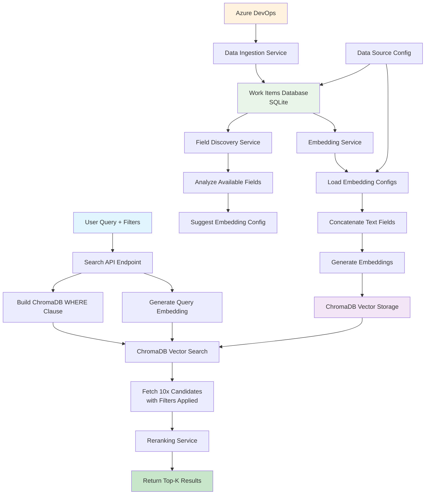
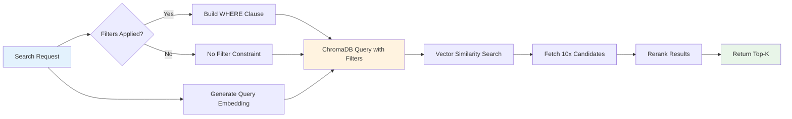
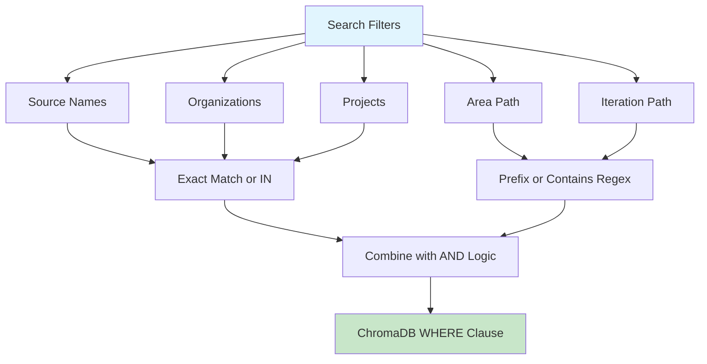
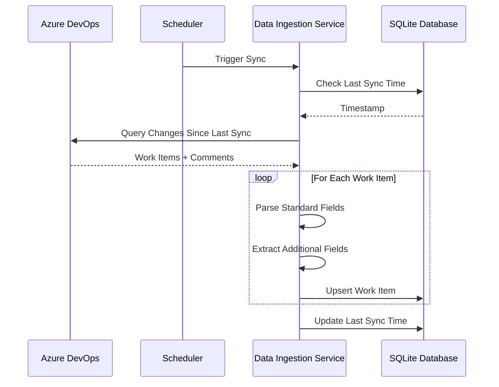
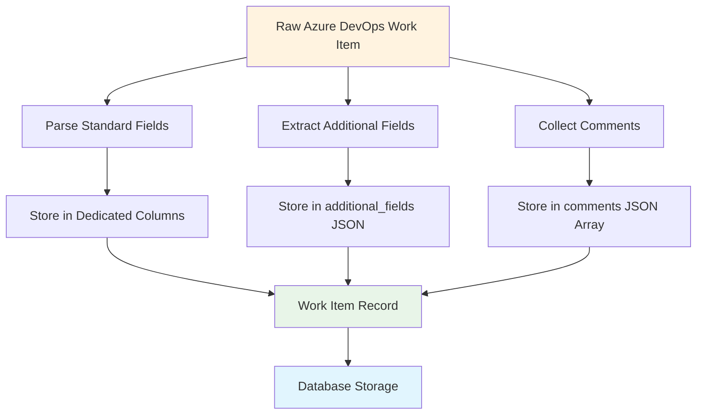
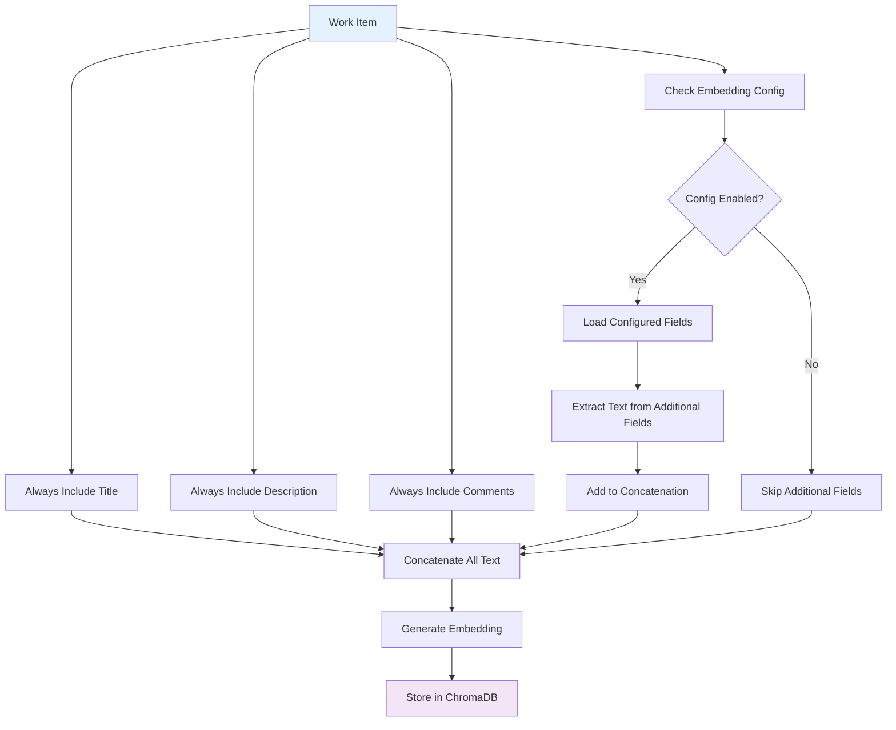
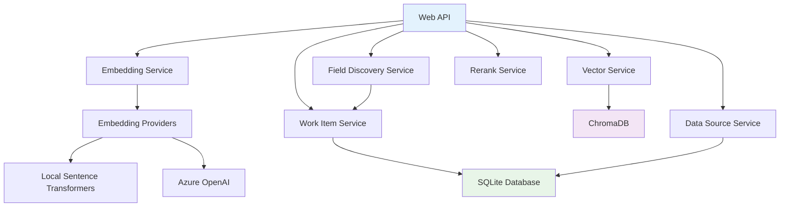
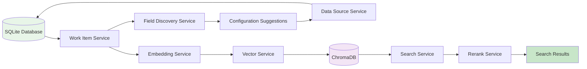
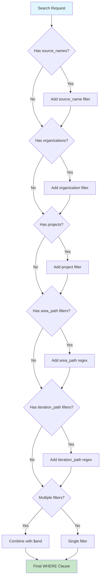

# Architecture Diagrams

This document contains visual diagrams to help understand the Orbis Search system architecture, data flows, and component relationships.

## Table of Contents

1. [Complete System Architecture](#complete-system-architecture)
2. [Search and Filtering Flow](#search-and-filtering-flow)
3. [Data Ingestion Flow](#data-ingestion-flow)
4. [Embedding Generation Flow](#embedding-generation-flow)
5. [Component Relationships](#component-relationships)

## Complete System Architecture

The following diagram shows the complete search and filtering architecture from data ingestion to search results:



## Search and Filtering Flow

### Two-Tier Search Process



### Filter Types and Processing



## Data Ingestion Flow

### Azure DevOps to Database



### Work Item Processing



## Embedding Generation Flow

### Configuration-Driven Text Concatenation



### Embedding Storage Structure

```mermaid
graph LR
    A[Work Item Data] --> B[Text Concatenation]
    B --> C[Embedding Vector]
    
    A --> D[Filterable Metadata]
    
    C --> E[ChromaDB Document]
    D --> E
    B --> E
    
    E --> F[Vector: [0.1, 0.2, ...]]
    E --> G[Metadata: source, org, project]
    E --> H[Document: concatenated text]
    
    style A fill:#e1f5fe
    style E fill:#f3e5f5
    style F fill:#fff3e0
    style G fill:#e8f5e8
    style H fill:#fce4ec
```

## Component Relationships

### Service Dependencies



### Data Flow Between Components



## Filter Processing Details

### WHERE Clause Building Logic



### Search Performance Flow


---

These diagrams provide visual representations of the key architectural concepts and workflows in the Orbis Search system. For detailed implementation information, refer to:

- [Search and Filtering Architecture](./SEARCH_AND_FILTERING_ARCHITECTURE.md)
- [Embedding Configuration Guide](./EMBEDDING_CONFIGURATION_GUIDE.md)
- [Database Schema and Workflows](./DATABASE_SCHEMA_AND_WORKFLOWS.md)
