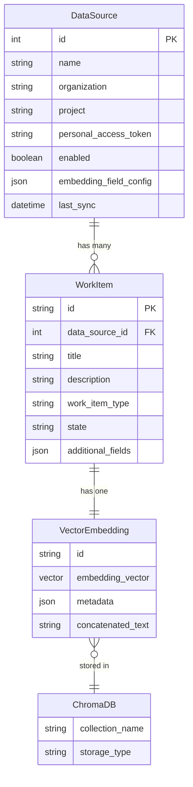
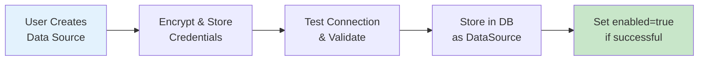
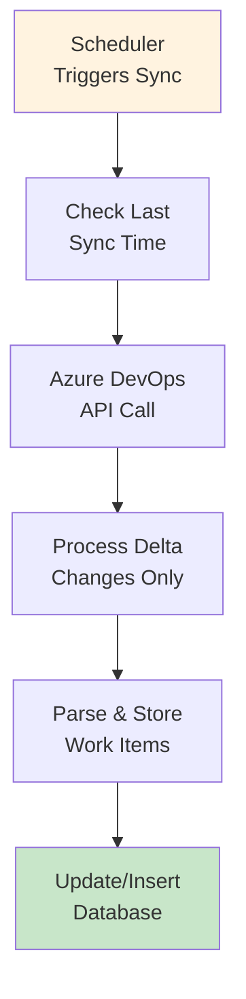
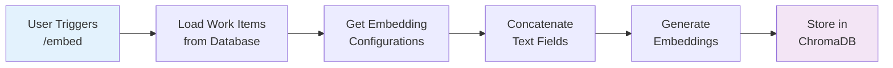
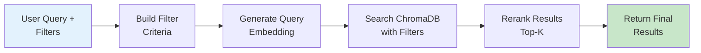
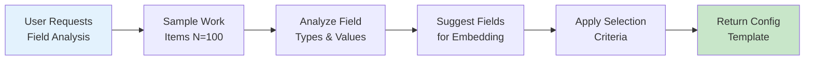
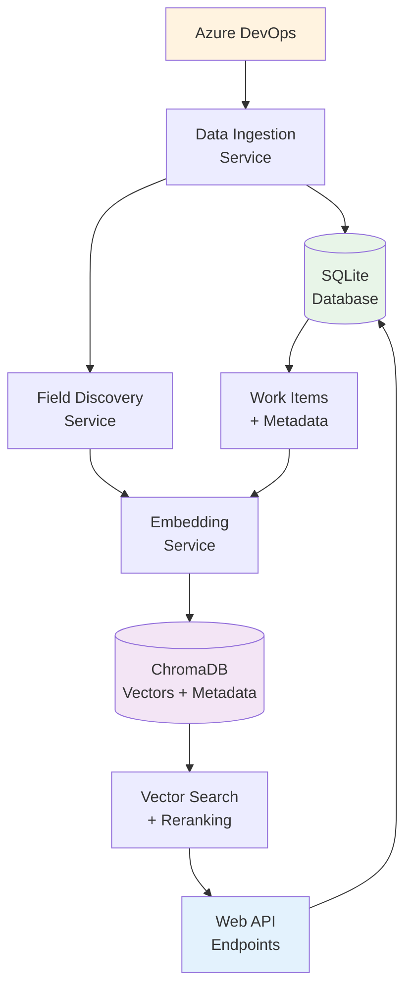
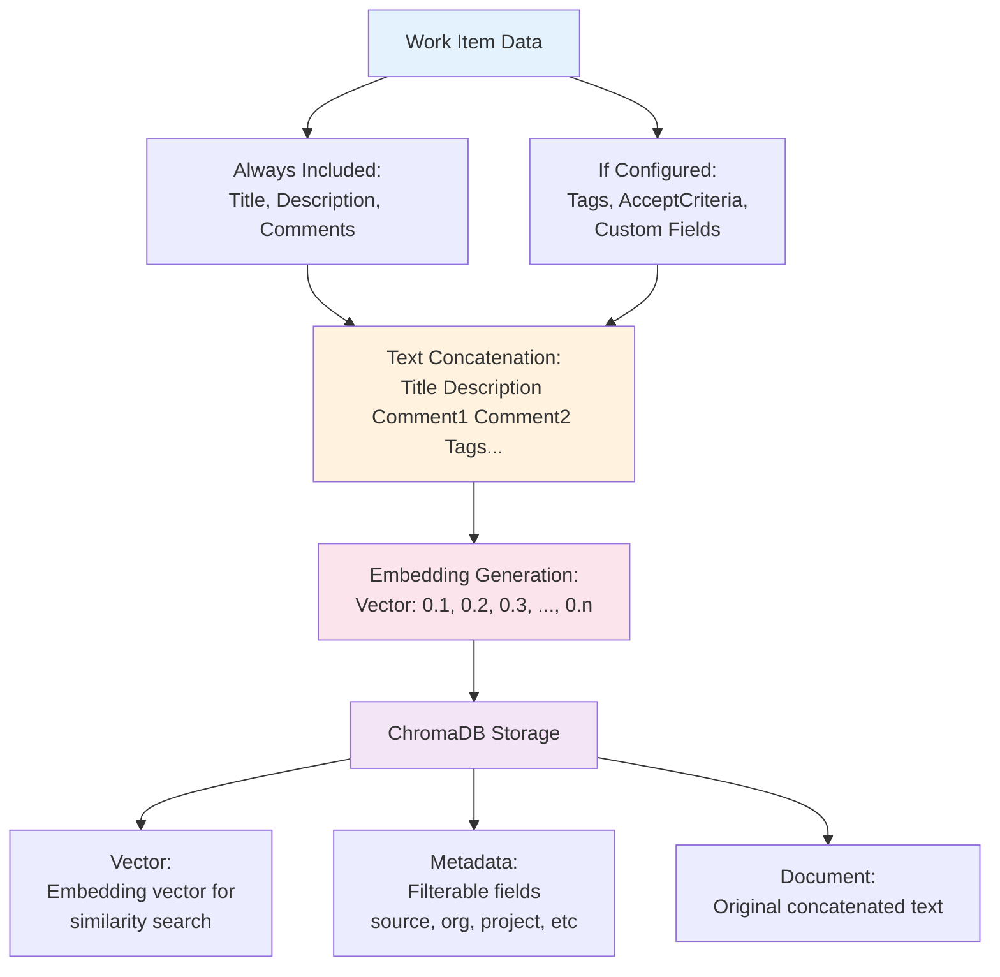
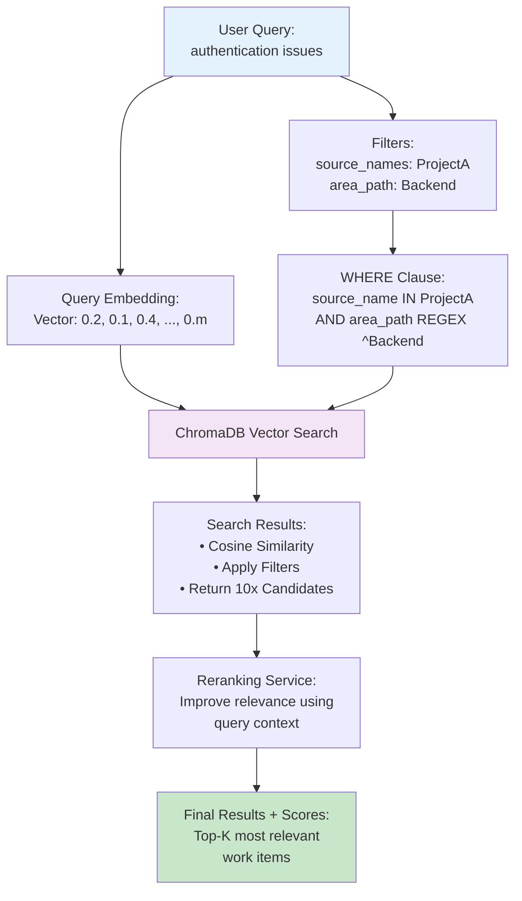

# Database Schema and Workflows

This document provides a comprehensive overview of the database schema, data relationships, and key workflows in the Orbis Search system.

## Table of Contents

1. [Database Schema Overview](#database-schema-overview)
2. [Core Entities](#core-entities)
3. [Data Relationships](#data-relationships)
4. [Key Workflows](#key-workflows)
5. [Data Flow Diagrams](#data-flow-diagrams)

## Database Schema Overview

Orbis Search uses SQLite for relational data storage and ChromaDB for vector embeddings. The system maintains data across two primary storage systems:

### SQLite Database (Relational Data)
- **Location**: `data/database/orbis_search.db`
- **Purpose**: Stores structured data, configurations, and metadata
- **Tables**: DataSources, WorkItems, and related entities

### ChromaDB (Vector Storage)
- **Location**: `data/chroma_db/`
- **Purpose**: Stores embeddings and metadata for semantic search
- **Collections**: Work item embeddings with searchable metadata

## Core Entities

### 1. DataSource

**Purpose**: Represents external data sources (Azure DevOps organizations/projects)

```python
class DataSourceModel(Base):
    __tablename__ = "data_sources"
    
    id: int                           # Primary key
    name: str                         # Unique data source name
    organization: str                 # Azure DevOps organization
    project: str                      # Azure DevOps project
    personal_access_token: str        # Encrypted PAT
    enabled: bool = True              # Whether source is active
    embedding_field_config: dict      # JSON: embedding configuration
    last_sync: datetime              # Last successful sync timestamp
    created_at: datetime             # Creation timestamp
    updated_at: datetime             # Last update timestamp
```

**Key Features**:
- **Encrypted Credentials**: PAT stored using Fernet encryption
- **Embedding Configuration**: Per-source field selection for embeddings
- **Sync Tracking**: Monitors last successful synchronization

### 2. WorkItem

**Purpose**: Represents individual work items from Azure DevOps

```python
class WorkItemModel(Base):
    __tablename__ = "work_items"
    
    id: str                          # Work item ID from Azure DevOps
    data_source_id: int              # Foreign key to DataSource
    title: str                       # Work item title
    description: str                 # Work item description
    work_item_type: str              # Bug, Task, Story, etc.
    state: str                       # Active, Closed, etc.
    priority: str                    # Priority level
    severity: str                    # Severity level
    area_path: str                   # Team/area hierarchy
    iteration_path: str              # Sprint/iteration hierarchy
    assigned_to: str                 # Assigned person
    created_by: str                  # Creator
    tags: List[str]                  # Work item tags
    comments: List[str]              # All comments
    additional_fields: dict          # JSON: custom/additional fields
    created_at: datetime             # Creation in Azure DevOps
    updated_at: datetime             # Last update in Azure DevOps
    synced_at: datetime              # Last sync to our system
    
    # Relationships
    data_source: DataSourceModel     # Related data source
```

**Key Features**:
- **Standard Fields**: Core Azure DevOps fields for filtering and display
- **Dynamic Fields**: Additional custom fields stored as JSON
- **Comments Integration**: All comments stored as searchable list
- **Sync Tracking**: Tracks when work item was last synchronized

## Data Relationships

### Entity Relationship Diagram



### Relationship Details

**DataSource → WorkItem (1:Many)**
- One data source can have many work items
- Work items belong to exactly one data source
- Cascade delete: removing data source removes all its work items

**WorkItem → ChromaDB (1:1)**
- Each work item has one corresponding embedding
- Embedding metadata references work item attributes
- Embeddings are recreated when work items change

## Key Workflows

### 1. Data Source Registration Workflow



**Steps**:
1. User provides Azure DevOps organization, project, and PAT
2. System encrypts PAT using Fernet encryption
3. System tests connection to Azure DevOps API
4. If successful, stores DataSource with `enabled=true`
5. If failed, stores but sets `enabled=false`

### 2. Work Item Ingestion Workflow



**Steps**:
1. Scheduler runs periodic sync (configurable interval)
2. System checks `last_sync` timestamp for each enabled data source
3. Calls Azure DevOps Reporting API for changes since last sync
4. Processes each changed work item:
   - Standard fields stored in dedicated columns
   - Additional fields stored in `additional_fields` JSON column
   - Comments collected and stored as JSON array
5. Updates `last_sync` timestamp on success

### 3. Embedding Generation Workflow



**Steps**:
1. User calls `/embed` endpoint (optionally with `force_rebuild=true`)
2. System loads all work items from enabled data sources
3. For each data source, loads embedding field configuration
4. For each work item:
   - Concatenates title, description, comments (always)
   - Adds configured additional fields (if enabled)
   - Generates embedding using configured provider (local/Azure)
5. Stores embeddings with metadata in ChromaDB
6. Metadata includes filterable fields for search

### 4. Search Workflow



**Steps**:
1. User submits search request with query text and optional filters
2. System builds ChromaDB WHERE clause from filters
3. System generates embedding for query text
4. ChromaDB searches with cosine similarity and applies filters
5. System fetches 10x more candidates than needed
6. Reranking service improves result relevance
7. Returns top-k results with similarity scores

### 5. Field Discovery Workflow



**Steps**:
1. User calls field discovery API for a data source
2. System samples up to 100 work items from that source
3. Analyzes both standard fields and `additional_fields` JSON
4. For each field, calculates:
   - Coverage percentage (how many items have this field)
   - Data types (string, number, boolean, etc.)
   - Sample values (for preview)
5. Applies filtering criteria:
   - Only suggests text (string) fields
   - Excludes system fields (IDs, dates, metadata)
   - Prioritizes high-coverage fields
6. Returns suggested configuration ready for application

## Data Flow Diagrams

### Complete System Data Flow



### Embedding Data Flow



### Search Data Flow



---

This schema documentation provides the foundation for understanding how data flows through the Orbis Search system and how the various components interact to provide intelligent search capabilities.
