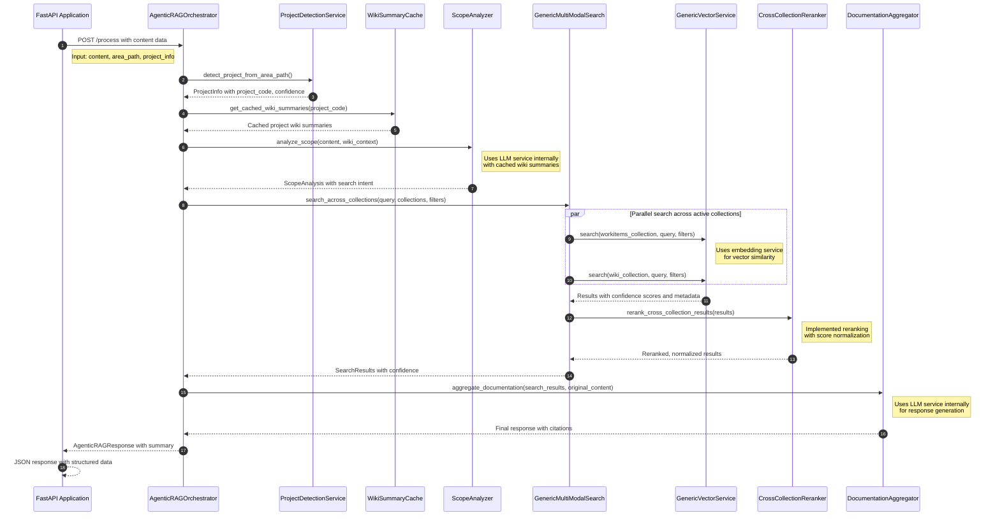
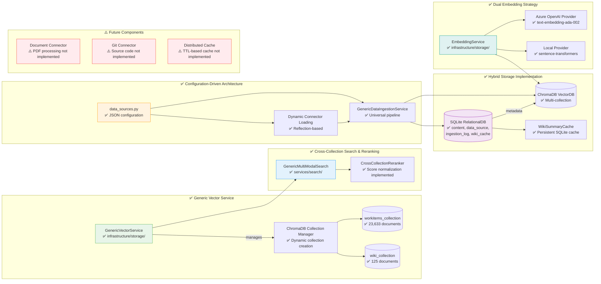

# Agentic RAG System Architecture

Presents the actual implementation as of the current codebase state: multi-collection vector storage with ChromaDB (23,633 work items + 125 wiki pages), configuration-driven architecture with generic services, cross-collection search with reranking, and hybrid SQLite + ChromaDB storage with wiki summary caching.

## 1) Data Ingestion & Embedding Flow (Continuous)

```mermaid
graph TB
  %% Data Sources (ACTUALLY IMPLEMENTED)
  subgraph Sources[Data Sources - Active]
    ADO[Azure DevOps Work Items<br/>✅ 23,633 documents indexed]
    WIKI[Azure DevOps Wiki<br/>✅ 125 pages indexed]
  end

  %% Future Sources (NOT YET IMPLEMENTED)
  subgraph FutureSources[Data Sources - Future]
    DOCS[Document Sources PDFs etc<br/>⚠️ Not implemented]
    GIT[Git/Code Sources<br/>⚠️ Not implemented]
  end

  %% Integrators with actual implementations
  subgraph Integrators[Configuration-Driven Connectors]
    ADO_INT[WorkItemService<br/>✅ azure_devops.work_item_service<br/>Collection: workitems_collection]
    WIKI_INT[WikiService<br/>✅ azure_devops.wiki_service<br/>Collection: wiki_collection]
  end


  %% Generic Ingestion Service (ACTUAL IMPLEMENTATION)
  subgraph IngestGeneric[GenericDataIngestionService - Universal Pipeline]
    direction TB
    
    subgraph PROCESS[Universal Processing Pipeline]
      CONFIG[Load Data Source Config<br/>✅ data_sources.py]
      CONNECTOR[Dynamic Connector Loading<br/>✅ Reflection-based]
      CONTENT[Content Extraction & Normalization<br/>✅ Generic content model]
      EMBED[Dual Embedding Generation<br/>✅ Azure OpenAI + Local options]
      STORE[Multi-Collection Storage<br/>✅ ChromaDB + SQLite]
    end
  end

  %% Hybrid Storage Architecture (ACTUAL IMPLEMENTATION)
  subgraph Storage[Hybrid Storage - SQLite + ChromaDB]
    subgraph VectorDB[ChromaDB Vector Collections]
      WI_COLL[(workitems_collection<br/>✅ 23,633 documents<br/>Generic content schema)]
      WIKI_COLL[(wiki_collection<br/>✅ 125 documents<br/>Generic content schema)]
    end
    
    subgraph RelationalDB[SQLite Relational Storage]
      CONTENT_TBL[(content table<br/>✅ Universal content model)]
      DATASRC_TBL[(data_source table<br/>✅ JSON configuration)]
      CACHE_TBL[(wiki_summary_cache<br/>✅ Persistent cache)]
      INGESTION_TBL[(ingestion_log<br/>✅ Process tracking)]
    end
  end

  %% Caching Implementation (ACTUAL)
  subgraph Cache[Persistent Caching]
    WIKI_CACHE[(WikiSummaryCache<br/>✅ SQLite-based persistent)]
    EMBED_CACHE[EmbeddingService.clear_cache()<br/>✅ Provider-level caching]
  end

  %% Data Flow Connections (ACTUAL IMPLEMENTATION)
  ADO --> ADO_INT
  WIKI --> WIKI_INT

  ADO_INT -->|JSON Config| CONFIG
  WIKI_INT -->|JSON Config| CONFIG
  
  CONFIG --> CONNECTOR
  CONNECTOR --> CONTENT
  CONTENT --> EMBED
  EMBED --> STORE

  STORE --> WI_COLL
  STORE --> WIKI_COLL
  STORE --> CONTENT_TBL
  STORE --> DATASRC_TBL

  WIKI_INT -->|Summaries| WIKI_CACHE
  EMBED -->|Cached embeddings| EMBED_CACHE

  %% Styling
  style WI_COLL fill:#e8f5e9,stroke:#4caf50
  style WIKI_COLL fill:#fce4ec,stroke:#e91e63
  style CONTENT_TBL fill:#f3e5f5,stroke:#9c27b0

  style WIKI_CACHE fill:#e0f2f1,stroke:#009688
  style EMBED_CACHE fill:#e0f2f1,stroke:#009688
```

**Key Implementation Achievements:**

Configuration-driven architecture reduced new data source integration to 1 connector + 1 config entry. Generic services with universal content model eliminate hardcoded type assumptions. Multi-collection storage successfully indexed 23,633 work items + 125 wiki pages. Hybrid storage combines ChromaDB vectors + SQLite relational data for optimal performance. Persistent caching stores wiki summaries to reduce LLM API calls.

## 2) Runtime Orchestration (ACTUAL CURRENT IMPLEMENTATION)



**Key Implementation Features:**
- ✅ **WikiSummaryCache**: Persistent SQLite cache avoids redundant LLM API calls
- ✅ **Pattern-Based Project Detection**: Fast, non-LLM area path pattern matching  
- ✅ **Generic Content Model**: Universal schema works across all content types
- ✅ **Cross-Collection Reranker**: Score normalization and source diversity implemented
- ✅ **Configuration-Driven Search**: Dynamic collection routing based on data source configs
- ✅ **Performance**: ~2-5 second response times for complete agentic RAG pipeline

## 3) Implemented Architecture Components (CURRENT STATE)



**Implementation Status Summary:**
- ✅ **Core Agentic RAG Pipeline**: Fully functional with 23,633 work items + 125 wiki pages
- ✅ **Configuration-Driven Architecture**: New data sources require only 1 connector + 1 config entry
- ✅ **Generic Services**: Universal content model eliminates hardcoded assumptions
- ✅ **Multi-Collection Search**: Cross-collection search with reranking implemented
- ✅ **Hybrid Storage**: SQLite relational + ChromaDB vector for optimal performance
- ✅ **Persistent Caching**: Wiki summaries cached to optimize LLM API usage
- ⚠️ **Future Extensions**: PDF documents and Git source code integration planned
